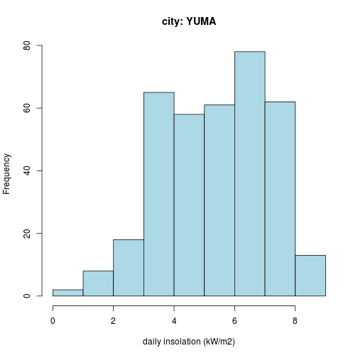

US solar insolation application
========================================================
title: US solar insolation application
author: Marc Finot
date: 2/20/2015

Executive summary
========================================================

This presentation illustrates a simple application to predict the solar energy productionn of a specific location in the US. It is using the TMY3 databased published by NREL (http://rredc.nrel.gov/solar/old_data/nsrdb/1991-2005/tmy3/)

- select of a given city 
- load the specific data from this city
- compute summaries related to the horizontal insolation
- estimate solar energy based on a given solar panel system size.

Application published on RStudio server: https://mfinot.shinyapps.io/Data_Products/

Selection of the city
========================================================
<small>
load the list of cities for selection

```r
TMYlocationfile <- "http://rredc.nrel.gov/solar/old_data/nsrdb/1991-2005/tmy3/TMY3_StationsMeta.csv"
location_table <- read.csv(TMYlocationfile, header=TRUE)
location_table$location <- paste(location_table$State,location_table$Site.Name)
head(location_table$location)
```

```
[1] "CA TWENTYNINE PALMS"                       
[2] "TX ABILENE DYESS AFB"                      
[3] "WA WHIDBEY ISLAND NAS"                     
[4] "AZ YUMA MCAS"                              
[5] "AK SELAWIK"                                
[6] "AK BARROW W POST-W ROGERS ARPT [NSA - ARM]"
```
</small>
Selection of a city 
========================================================
<small>

```r
location_USAF <- 699604
#  location_USAF <- location
file <- paste("http://rredc.nrel.gov/solar/old_data/nsrdb/1991-2005/data/tmy3/",location_USAF,"TYA.CSV",sep="")
#  print(file)
table <- read.csv(file,header = TRUE, skip = 1)
daily_sun <- tapply(0.001 * table$GHI..W.m.2., table$Date..MM.DD.YYYY., sum)
summary(daily_sun)
```

```
   Min. 1st Qu.  Median    Mean 3rd Qu.    Max. 
  0.610   3.998   5.643   5.395   6.856   8.587 
```

</small>
daily sun  and  energy production
========================================================
<small>
 

```
[1] "annual production (MWh): 9.845295"
```
</small>
